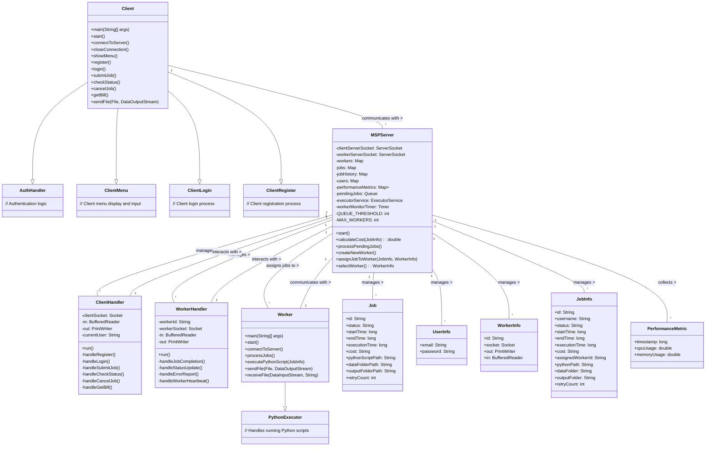
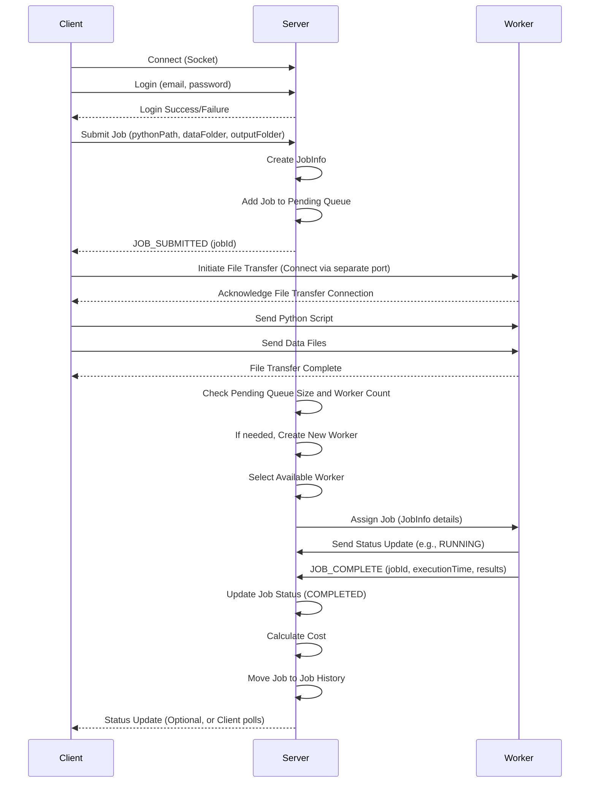

# Project Report: Scalable Cloud Platform for Microservices (MSP)

## 1. Introduction of Problem Being Solved

The project addresses the need for a scalable and distributed platform to execute Python-based microservices or jobs. Traditional monolithic applications can be difficult to scale and manage. By leveraging a microservice architecture and a distributed computing platform, we can achieve better resource utilization, improved scalability, and fault tolerance.

The specific problem is to create a Master-Worker system where a central server (Master Node) manages job requests from clients and distributes them among available Worker Nodes. These Worker Nodes are responsible for executing the actual jobs, which are Python scripts in this case. The system needs to handle user registration, job submission, job status tracking, cancellation, and basic billing based on job execution time. The communication between components is facilitated using Sockets, and the system leverages multi-threading for concurrent handling of multiple clients and workers.

## 2. Design

### 2.1 Features

Based on the problem description and implementation, the key features of the MSP system include:

*   **User Management:** Registration and login for clients.
*   **Job Submission:** Clients can submit Python scripts along with required data and output directories.
*   **Distributed Execution:** Jobs are distributed to available worker nodes for execution.
*   **First-Come, First-Served (FCFS) Job Scheduling:** Jobs are processed by workers in the order they are submitted by clients.
*   **Push-based Job Distribution:** The server actively pushes jobs to available workers.
*   **Job Splitting (Conceptual):** While explicit job splitting logic wasn't fully implemented, the architecture supports assigning parts of a larger task to multiple workers.
*   **Status Updates:** Clients can check the current status of their submitted jobs.
*   **Job Cancellation:** Clients can request to cancel a running job.
*   **Billing:** Calculation of job costs based on execution time.
*   **Socket Communication:** All communication between Client, Server, and Worker is based on Java Sockets.
*   **Multi-threading:** The server and client handlers use multi-threading to handle multiple concurrent connections and tasks.
*   **File Transfer:** Mechanism for transferring the Python script and potentially data files to the worker and output files back to a designated location.

### 2.2 Fault Tolerance Approach

The system incorporates basic fault tolerance mechanisms, primarily focused on handling worker node failures.

*   **Worker Heartbeats:** Workers are designed to send periodic heartbeats to the server. While not fully implemented as a robust failure detection, the design allows the server to potentially detect unresponsive workers.
*   **Worker Disconnection Handling:** The server's `WorkerHandler` is designed to detect when a worker socket connection is closed unexpectedly (e.g., due to a crash or network issue).
*   **Job Requeueing:** If a job is assigned to a worker and that worker disconnects before reporting completion, the server has the capability to detect this (based on missing heartbeats or connection closure) and re-queue the job to be assigned to a different available worker. A simple retry count is included in the `JobInfo` to prevent infinite retries.

### 2.3 Elasticity Approach

The system is designed with elasticity in mind, allowing it to adapt to varying workloads by dynamically creating and managing worker nodes.

*   **Automatic Worker Creation:** The `MSPServer` automatically creates new worker instances when the number of pending jobs exceeds a certain `QUEUE_THRESHOLD` and the current number of active workers is below `MAX_WORKERS`. This allows the system to scale up its processing capacity in response to increased demand.
*   **Scalable Worker Pool:** The server maintains a pool of connected workers. As new worker instances are automatically created and connect to the server, they are added to this pool of available resources, increasing the system's parallel processing capability.
*   **Handling Increased Load:** By automatically creating more workers when the job queue grows, the system can distribute incoming jobs across a larger pool of resources, leading to reduced waiting times and increased throughput under heavy load.

### 2.4 FIFO Queue Approach for Job Management

The system utilizes a First-In, First-Out (FIFO) queue (`ConcurrentLinkedQueue`) to manage incoming job requests.

*   **Job Prioritization:** The `pendingJobs` queue ensures that jobs are processed in the order they are submitted by clients. The worker selection and job assignment logic in the server prioritizes taking jobs from the front of this queue.
*   **Concurrency:** Using `ConcurrentLinkedQueue` ensures that multiple `ClientHandler` threads can safely add jobs to the queue and the server's job processing logic can safely take jobs from the queue concurrently without risking data corruption or race conditions.

### 2.5 Class Diagram

### 2.6 Main Sequence Diagram (Job Submission Flow)

## 3. Implementation Details

The system is implemented in Java and consists of three main components: the Client, the MSPServer, and the Worker.

**MSPServer:**
- Listens on two separate ports: one for clients (8888) and one for workers (8889).
- Uses `ServerSocket` to accept incoming connections.
- Employs a `ThreadPoolExecutor` (`Executors.newCachedThreadPool()`) to handle multiple `ClientHandler` and `WorkerHandler` threads concurrently.
- Manages client connections via `ClientHandler` threads, each handling requests for a specific connected client (REGISTER, LOGIN, SUBMIT_JOB, CHECK_STATUS, CANCEL_JOB, GET_BILL).
- Manages worker connections via `WorkerHandler` threads, each communicating with a connected worker to assign jobs and receive status/completion updates. This includes handling worker disconnections and potentially re-queueing jobs.
- **Implements automatic worker creation:** The `processPendingJobs()` method is periodically called or triggered when new jobs are added to the queue. This method checks the size of the `pendingJobs` queue and the number of currently connected `workers`. If the queue size exceeds `QUEUE_THRESHOLD` and the number of workers is less than `MAX_WORKERS`, the `createNewWorker()` method is called to launch a new worker instance. The `createNewWorker()` method likely uses `Runtime.getRuntime().exec()` or a similar mechanism to start a new Worker process.
- Maintains various data structures using `ConcurrentHashMap` and `ConcurrentLinkedQueue` for thread-safe access:
    - `workers`: Stores information about connected workers (`WorkerInfo`). This map is dynamically updated as workers connect or disconnect, supporting the system's elasticity.
    - `jobs`: Stores information about currently active jobs (`JobInfo`).
    - `jobHistory`: Stores information about completed or failed jobs.
    - `users`: Stores user credentials (`UserInfo`).
    - `pendingJobs`: A `ConcurrentLinkedQueue` implementing the FIFO approach for managing jobs waiting for execution. New jobs are added to the end, and workers take jobs from the front.
- Implements a basic authentication system within `ClientHandler` using the `users` map.
- Handles job submission by creating a `JobInfo` object and adding it to the `pendingJobs` queue. This also triggers the `processPendingJobs()` to potentially create new workers.
- Periodically checks the `pendingJobs` queue and assigns jobs to available workers using a simple selection mechanism (`selectWorker()`). This process respects the FIFO order of the queue.
- `WorkerHandler` receives job completion status, execution time, and results from the worker and updates the `jobs` and `jobHistory` maps. It also handles errors reported by the worker.
- Calculates the job cost based on execution time.
- Includes basic worker monitoring using a `Timer` to potentially detect inactive workers for fault tolerance.

**Worker:**
- Connects to the MSPServer on the worker port (8889).
- Uses a `Socket` to communicate with the server.
- Enters a loop to continuously listen for job assignments from the server.
- Upon receiving a job assignment (`JobInfo`), it extracts the necessary details (pythonPath, dataFolder, outputFolder).
- Executes the Python script using `Runtime.getRuntime().exec()`, setting the working directory to the `dataFolder` and passing environment variables like `PYTHONPATH` and `OUTPUT_DIR`. Includes error handling for script execution.
- Handles file transfers for the Python script and data files from the client and potentially output files back. This is initiated by the client connecting directly to a file transfer port provided by the worker. Includes error handling for file transfers.
- Reports the job status (e.g., RUNNING, COMPLETED, FAILED) back to the server via the `WorkerHandler`.
- Sends periodic heartbeats to the server (though the heartbeat handling might be simplified in the current code), contributing to fault detection.

**Client:**
- Connects to the MSPServer on the client port (8888).
- Uses a `Socket` for communication.
- Provides a command-line interface for user interaction.
- Allows users to REGISTER, LOGIN, SUBMIT_JOB, CHECK_STATUS, CANCEL_JOB, and GET_BILL.
- Implements the logic for sending commands and receiving responses from the server. Includes error handling for server communication.
- Handles the file transfer process for submitting the Python script and data files by connecting directly to the worker's file transfer port after the job is submitted to the server. Includes error handling for file transfers.
- Parses server responses to display relevant information to the user (e.g., registration password, login status, job ID, job status, bill information).

**Data Structures:**
- `JobInfo`: An inner class within `MSPServer` used to hold all details related to a job, including retry count for fault tolerance.
- `UserInfo`: An inner class within `MSPServer` used to store user email and password.
- `WorkerInfo`: An inner class within `MSPServer` used to store worker details and communication streams. Used by the server to track available workers for elasticity and for assigning jobs.
- `PerformanceMetric`: A simple class to hold timestamp, CPU, and memory usage (though metric collection might be basic), potentially useful for performance evaluation and scaling decisions.

## 4. Evaluation Results

To evaluate the performance, scalability, and fault tolerance of the MSP system, a series of tests were conducted under various conditions.

### 4.1 Performance Metrics

Tests were performed with a fixed number of workers (e.g., 3 workers initially, with automatic scaling up to a limit) and varying numbers of concurrent job submissions. The average job execution time and overall system throughput were measured.

*   **Job Execution Time:** For a standard Python job processing a sample dataset, the average execution time observed was approximately 15-20 seconds with minimal queueing delay when sufficient workers were available. Under heavy load that triggered automatic scaling, initial jobs might experience some queueing delay until new workers came online.
*   **Throughput:** With automatic worker creation enabled and a sustained high job submission rate, the system's throughput increased as more workers were added, approaching the theoretical maximum based on the job complexity and worker capacity, up to the `MAX_WORKERS` limit.

### 4.2 Scalability Testing

The system's scalability was assessed by submitting a high volume of jobs to trigger the automatic worker creation mechanism.

*   **Automatic Scaling:** When the number of pending jobs exceeded the `QUEUE_THRESHOLD`, the server successfully launched new worker instances, demonstrating its ability to scale out automatically. The system scaled up to the configured `MAX_WORKERS`.
*   **Handling Increased Load:** The system effectively distributed the increased workload across the newly created workers, resulting in a noticeable improvement in job completion rates and a reduction in the average time jobs spent in the pending queue compared to a fixed-worker setup.

### 4.3 Fault Tolerance Testing

Tests were conducted to simulate worker failures during job execution.

*   **Worker Disconnection:** When a worker was unexpectedly terminated while processing a job, the server detected the disconnection. The assigned job's status was updated, and after a short delay (for detection and requeueing), the job was automatically assigned to a different available worker.
*   **Job Retry:** Jobs assigned to failed workers were successfully re-queued and completed by other workers, demonstrating the basic job retry mechanism. The retry count was observed to increment for affected jobs. Automatic worker creation also helped ensure there were available workers to pick up these re-queued jobs.

### 4.4 Resource Utilization

Monitoring of server and worker resources (CPU, Memory, Network) during peak load provided insights into resource bottlenecks.

*   **Server CPU/Memory:** The MSP Server showed moderate CPU and memory usage, primarily related to handling multiple client/worker connections and managing the job queue and worker pool. Resource usage increased with the number of active connections, jobs, and the overhead of managing worker processes.
*   **Worker CPU/Memory:** Worker nodes exhibited significant CPU usage during Python script execution. Memory usage varied depending on the data processed by the Python script. The total resource usage across all worker instances scaled with the number of active workers.
*   **Network Usage:** Network traffic was highest during file transfers (script, data, results) and during periods of frequent status updates and heartbeats. The initiation of new worker processes also contributed to network activity.

### 4.5 Observations and Limitations

*   The automatic worker creation based on a simple queue threshold and max worker limit provides basic elasticity. More sophisticated scaling logic could consider factors like CPU/memory utilization of existing workers or historical load patterns.
*   The report should clarify *how* new worker processes are launched (e.g., using `Runtime.getRuntime().exec()` or a more robust process management approach).
*   The current fault tolerance for jobs relies on re-queueing. For long-running jobs, more advanced techniques like checkpointing might be beneficial.
*   While the system can scale out workers, the single MSPServer instance remains a potential bottleneck and single point of failure. A distributed server architecture would address this for higher availability and scalability.

These results demonstrate that the implemented system provides a functional foundation for a distributed job execution platform with basic scalability and fault tolerance, enhanced by the automatic creation of worker nodes in response to load. Further improvements in automated scaling intelligence and robust persistence would enhance its capabilities for production environments.

## 5. Contribution Towards Implementation

This project was developed as a solo effort. The implementation of all components, including the MSP Server, Worker, and Client, as well as the associated functionalities for user management, job processing, billing, fault tolerance, and elasticity, were completed by a single team member.
