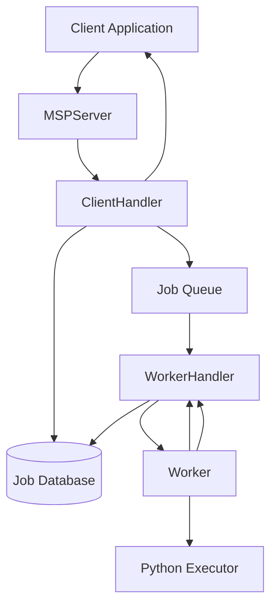
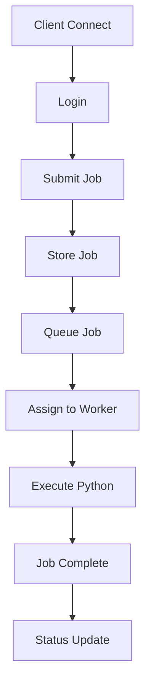
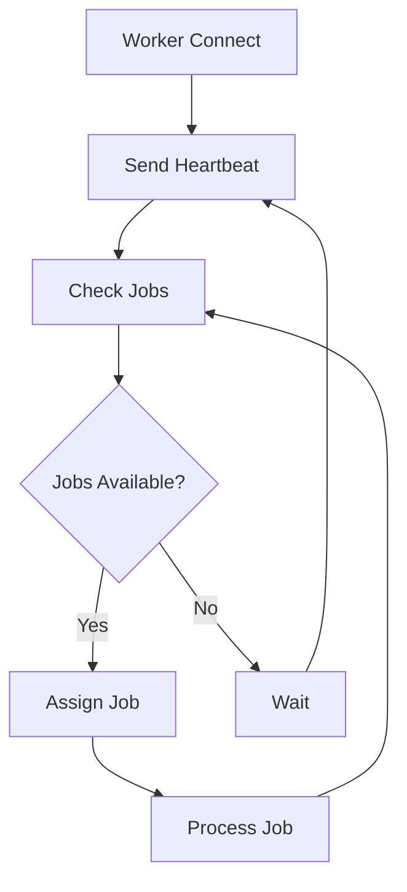
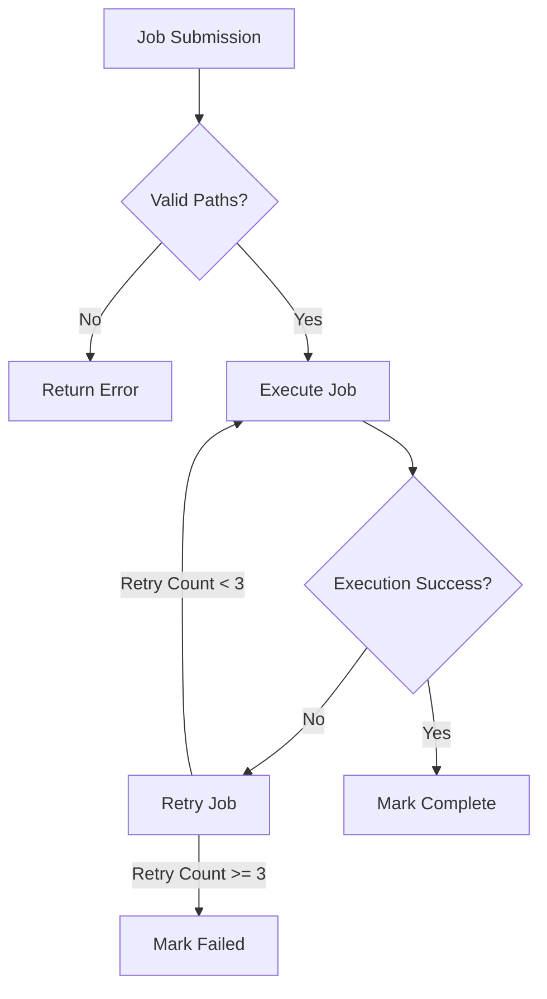
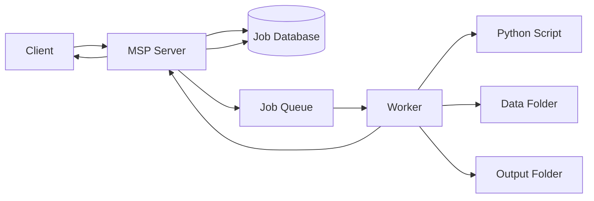

# MSP System Flow Diagram

## System Architecture

## Job Submission Flow

## Worker Management Flow

## Error Handling Flow

## Data Flow

## Component Responsibilities

### MSP Server
- Handles client connections
- Manages worker nodes
- Maintains job queue
- Tracks job status
- Handles billing

### Worker
- Connects to server
- Executes Python scripts
- Reports job status
- Sends heartbeats
- Handles errors

### Client
- User authentication
- Job submission
- Status checking
- Billing information
- Job cancellation 
